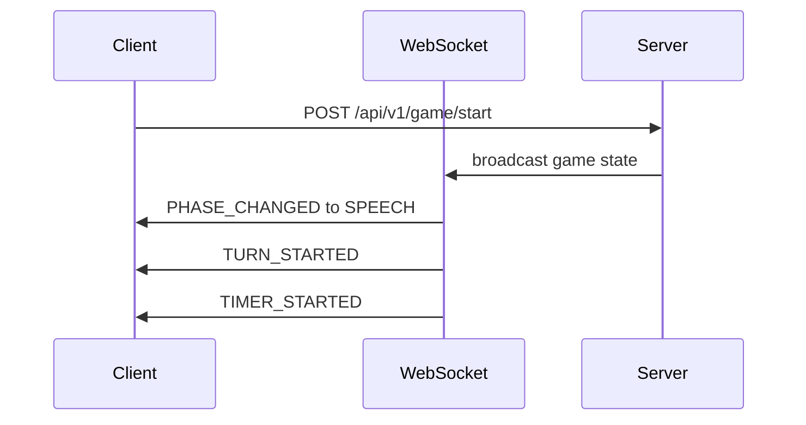
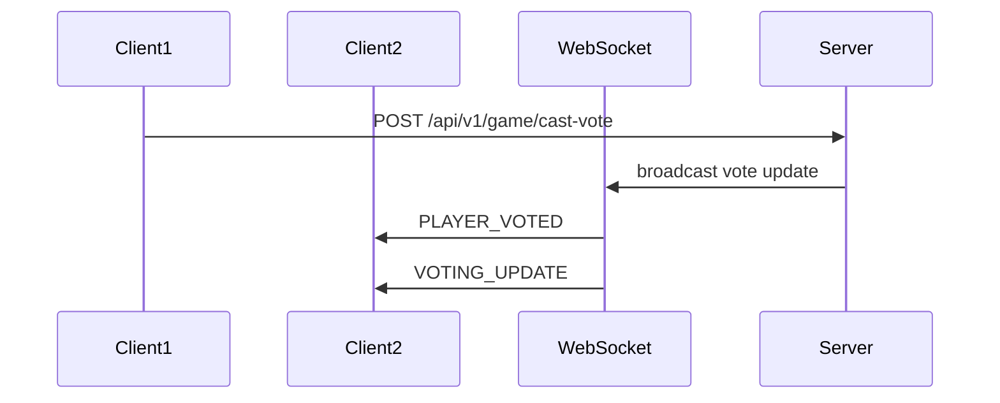

# 4단계: WebSocket 및 실시간 기능 통합

## 🎯 목표
WebSocket을 통한 실시간 통신 시스템을 구축하여 seamless한 게임 경험 제공

## 🔧 주요 작업

### 4.1 WebSocket 클라이언트 구축

#### WebSocket 연결 관리
- [ ] SockJS + STOMP 클라이언트 설정
- [ ] 자동 재연결 로직 구현
- [ ] 연결 상태 모니터링
- [ ] 연결 품질 표시 (핑/레이턴시)

```typescript
interface WebSocketManager {
  connect(): Promise<void>;
  disconnect(): void;
  subscribe(topic: string, callback: (message: any) => void): Subscription;
  send(destination: string, message: any): void;
  getConnectionState(): ConnectionState;
}
```

**담당 에이전트**: `frontend-developer`

**예상 작업 시간**: 2-3일

### 4.2 게임 상태 실시간 동기화

#### 게임 상태 구독 시스템
- [ ] `/topic/game/{gameNumber}/state` 구독
- [ ] 게임 단계 변경 실시간 반영
- [ ] 플레이어 상태 업데이트
- [ ] 턴 순서 동기화

```typescript
interface GameStateSubscriber {
  onGameStateUpdate(gameState: GameState): void;
  onPhaseChange(phase: GamePhase): void;
  onPlayerUpdate(player: Player): void;
  onTurnChange(currentPlayerId: number): void;
}
```

**담당 에이전트**: `frontend-developer`

#### 투표 시스템 실시간 피드백
- [ ] 투표 현황 실시간 업데이트
- [ ] 투표 완료 시 즉시 결과 표시
- [ ] 투표 결과 공개 애니메이션
- [ ] 동점 상황 처리

**담당 에이전트**: `game-designer`

**예상 작업 시간**: 2일

### 4.3 실시간 채팅 시스템

#### 채팅 메시지 실시간 처리
- [ ] `/topic/game/{gameNumber}/chat` 구독
- [ ] 메시지 타입별 렌더링 (HINT, DISCUSSION, DEFENSE, SYSTEM)
- [ ] 발화자별 메시지 구분
- [ ] 시간 순서 보장

```typescript
interface ChatMessage {
  id: number;
  gameNumber: number;
  playerNickname: string | null;
  content: string;
  type: 'HINT' | 'DISCUSSION' | 'DEFENSE' | 'POST_ROUND' | 'SYSTEM';
  timestamp: string;
}
```

#### 채팅 제한 시스템
- [ ] 게임 단계별 채팅 제한 적용
- [ ] 발언 권한 검증 (턴제 시 현재 플레이어만)
- [ ] 비속어 필터링 적용
- [ ] 스팸 방지 (메시지 주기 제한)

**담당 에이전트**: `frontend-developer`

#### 실시간 타이핑 인디케이터
- [ ] 타이핑 상태 브로드캐스트
- [ ] 타이핑 중인 사용자 표시
- [ ] 타임아웃 처리 (3초 후 자동 해제)

**담당 에이전트**: `frontend-developer`

**예상 작업 시간**: 3일

### 4.4 시스템 알림 및 피드백

#### 게임 이벤트 알림
- [ ] 플레이어 입장/퇴장 알림
- [ ] 게임 단계 변경 알림
- [ ] 투표 현황 알림
- [ ] 타이머 만료 경고

```typescript
interface NotificationManager {
  showPlayerJoined(playerName: string): void;
  showPhaseChanged(phase: GamePhase): void;
  showVotingUpdate(remaining: number): void;
  showTimeWarning(seconds: number): void;
}
```

#### Toast 알림 시스템
- [ ] 성공/에러/정보 메시지 표시
- [ ] 자동 사라짐 타이머
- [ ] 중요도별 스타일링
- [ ] 접근성 고려 (스크린 리더 호환)

**담당 에이전트**: `ui-ux-designer`

**예상 작업 시간**: 1-2일

### 4.5 오프라인/재연결 처리

#### 연결 끊김 대응
- [ ] 연결 끊김 감지 및 사용자 알림
- [ ] 자동 재연결 시도 (지수적 백오프)
- [ ] 재연결 시 게임 상태 복구
- [ ] 오프라인 모드 UI 표시

```typescript
interface ConnectionRecovery {
  onDisconnect(): void;
  attemptReconnect(): Promise<boolean>;
  recoverGameState(): Promise<GameState>;
  showOfflineIndicator(): void;
}
```

#### 게임 상태 복구
- [ ] `/api/v1/game/recover-state/{gameNumber}` 호출
- [ ] 누락된 메시지 복구
- [ ] 사용자 상태 동기화
- [ ] UI 상태 복원

**담당 에이전트**: `frontend-developer`

**예상 작업 시간**: 2-3일

### 4.6 성능 최적화

#### 메시지 처리 최적화
- [ ] 메시지 배칭 처리
- [ ] 불필요한 리렌더링 방지 (React.memo, useMemo)
- [ ] 대용량 채팅 히스토리 가상화
- [ ] 메모리 누수 방지 (구독 정리)

#### 네트워크 최적화
- [ ] 메시지 압축 적용
- [ ] 중복 메시지 필터링
- [ ] 우선순위 기반 메시지 처리
- [ ] 대역폭 모니터링

**담당 에이전트**: `performance-profiler`

**예상 작업 시간**: 2일

## 🔄 WebSocket 메시지 플로우

### 게임 시작 플로우


### 투표 플로우


## 📱 모바일 네트워크 대응

### 모바일 최적화
- [ ] 3G/4G 환경 대응
- [ ] 배터리 절약 모드
- [ ] 백그라운드 연결 관리
- [ ] 데이터 사용량 최적화

### 네트워크 품질 적응
- [ ] 연결 품질 감지
- [ ] 품질별 기능 조정
- [ ] 저대역폭 모드 지원

**담당 에이전트**: `frontend-developer`

## 🧪 테스트 전략

### 실시간 통신 테스트
- [ ] WebSocket 연결/재연결 테스트
- [ ] 메시지 순서 보장 테스트
- [ ] 대용량 메시지 처리 테스트
- [ ] 동시 접속자 테스트

### 에러 시나리오 테스트
- [ ] 네트워크 끊김 시나리오
- [ ] 서버 재시작 시나리오
- [ ] 메시지 손실 시나리오
- [ ] 지연 시간 시나리오

**담당 에이전트**: `test-engineer`

## 📋 완료 조건
- [ ] WebSocket 연결 안정성 99% 이상
- [ ] 메시지 전달 지연 시간 < 100ms
- [ ] 재연결 성공률 95% 이상
- [ ] 메모리 누수 0건
- [ ] 모바일 환경 정상 작동

## 🔄 다음 단계
`05_TESTING_AND_OPTIMIZATION.md` - 테스트 및 성능 최적화