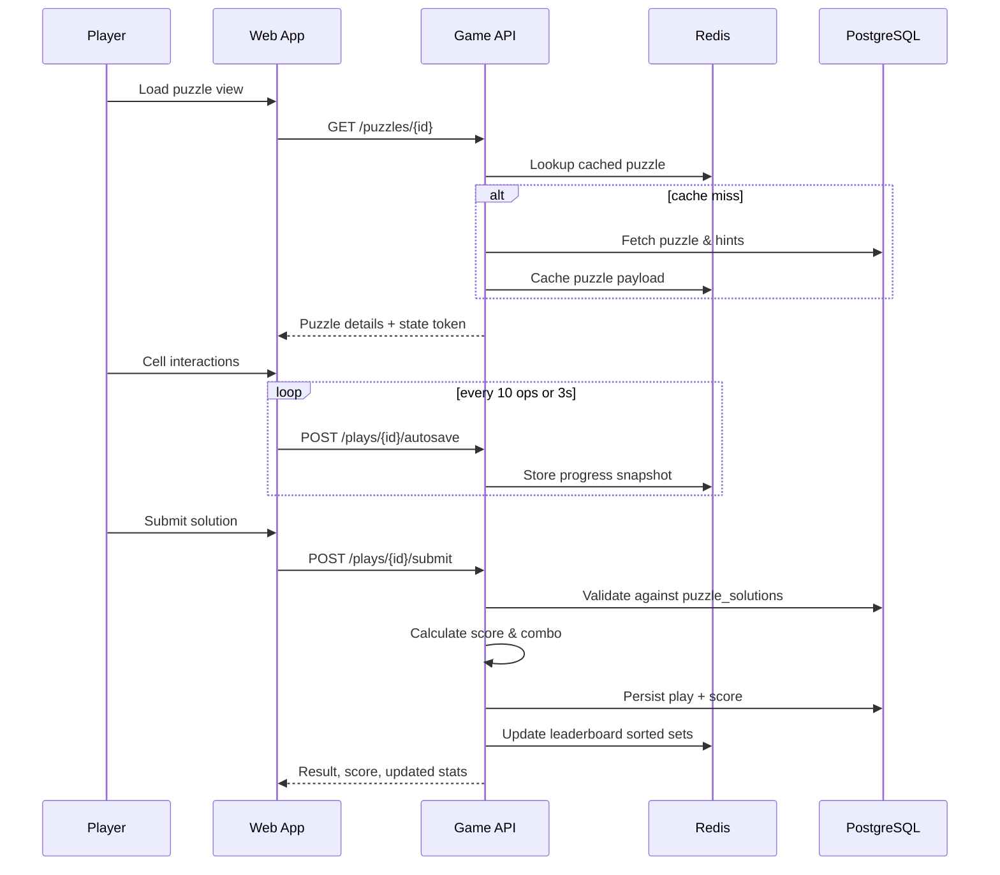
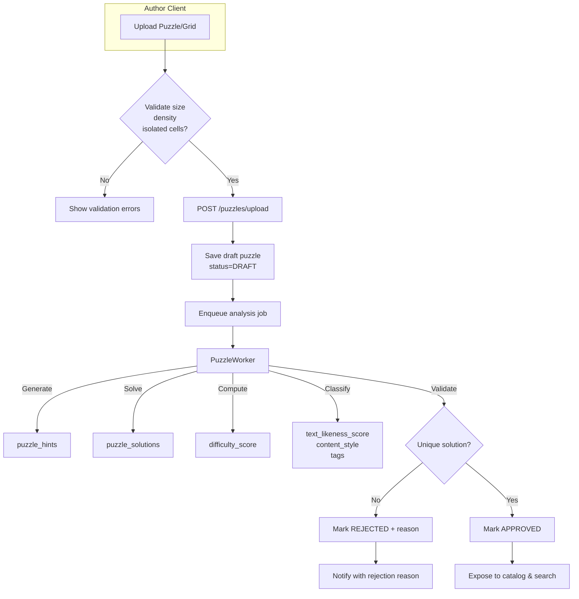
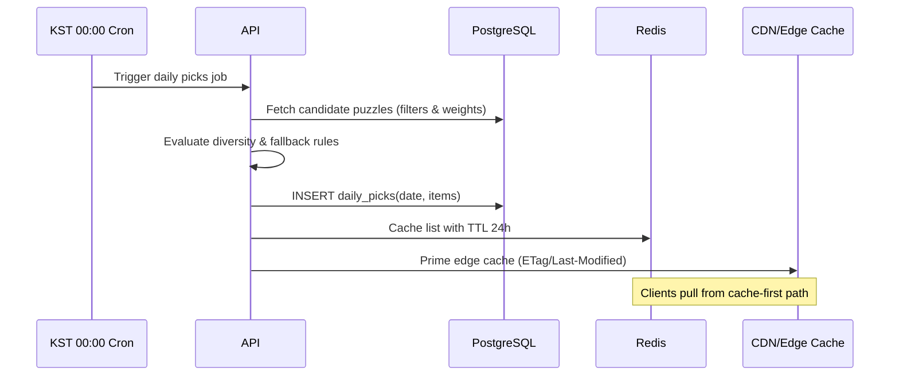
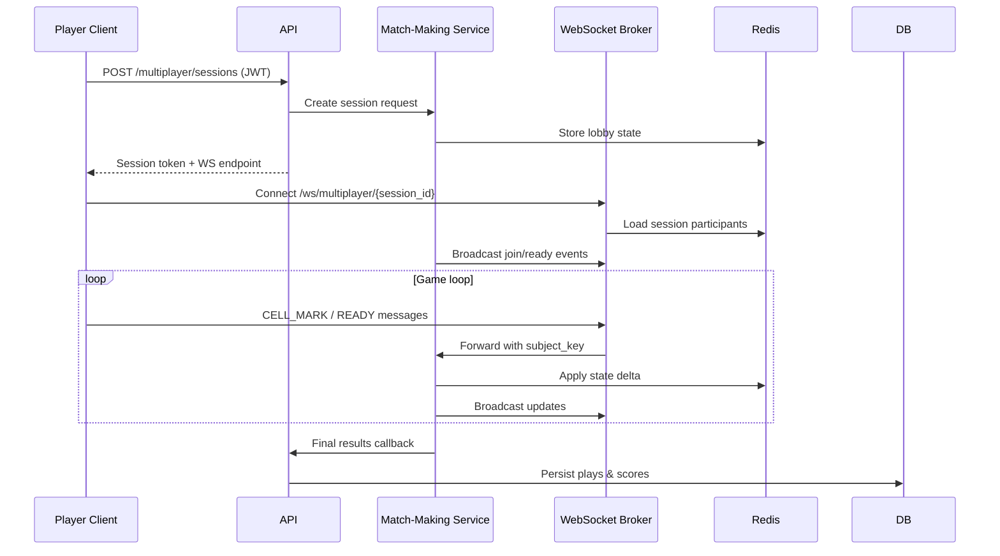
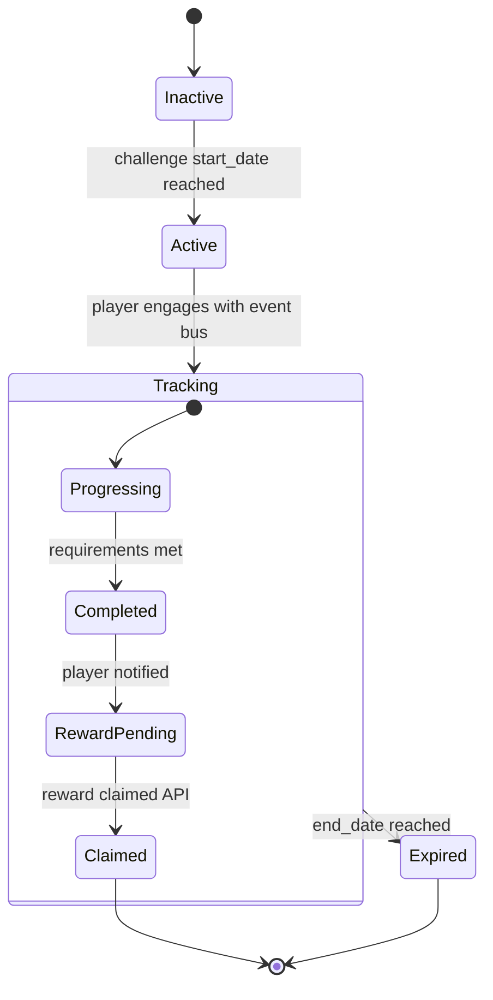

# Nemonemo Architecture

This document captures the high-level system design for the Nemonemo (Nonogram) platform. The diagrams below follow the requirements defined in `docs/nemonemo/DEVELOPMENT_PLAN.md`.

## 1. 전체 시스템 아키텍처

```mermaid
graph TD
    subgraph Client
        WebApp[React Web App]
        Editor[Puzzle Editor]
    end

    subgraph API["Spring Boot API"]
        RestAPI[REST Controllers]
        WS[WebSocket Gateway]
        Scheduler[Cron & Batch Jobs]
    end

    subgraph Services
        MatchService[Match-Making Service]
        AchievementService[Achievement Service]
        PuzzleWorker[Puzzle Worker\n(Solver & Analyzer)]
    end

    subgraph DataLayer
        PostgreSQL[(PostgreSQL)]
        Redis[(Redis)]
        ObjectStore[(CDN / Object Storage)]
    end

    WebApp -->|HTTPS| RestAPI
    Editor -->|HTTPS| RestAPI
    WebApp <-->|WebSocket| WS

    RestAPI -->|CRUD| PostgreSQL
    RestAPI -->|Cache / Sessions| Redis
    RestAPI -->|Assets| ObjectStore
    RestAPI -->|Tasks| PuzzleWorker
    Scheduler -->|Daily Picks / Season| RestAPI
    Scheduler -->|Preload| Redis

    WS -->|Match Events| MatchService
    MatchService -->|State| Redis

    AchievementService -->|Events| Redis
    AchievementService -->|Persistence| PostgreSQL
```

## 2. 플레이 시퀀스



## 3. 업로드 파이프라인



## 4. 오늘의 추천 선정 흐름



## 5. 멀티플레이어 매칭 및 세션



## 6. 도전 과제 및 업적 처리



```mermaid
flowchart LR
    PlayEvents[Play Events\n(Kafka/Redis Stream)] --> Eval[Achievement Service]
    Eval --> UpdateProgress[Update user_challenges\nuser_achievements]
    Eval --> Notify[Send push/in-app notification]
    UpdateProgress --> DB[(PostgreSQL)]
    Notify --> Redis[(Redis Pub/Sub)]
    Redis --> WebApp[Web Client\n(Toast/Inbox)]
```
