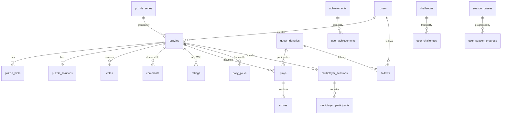

# Nemonemo Database Schema

본 문서는 Nemonemo 플랫폼의 핵심 데이터 모델을 정의합니다. 모든 스키마는 PostgreSQL 15 기준으로 작성되었으며, 환경 변수로 네임스페이스(prefix)를 조정할 수 있습니다.

## ER 다이어그램 (요약)



## 테이블 정의

```sql
CREATE TABLE users (
    id                UUID PRIMARY KEY,
    email             CITEXT UNIQUE NOT NULL,
    password_hash     TEXT NOT NULL,
    nickname          VARCHAR(40) NOT NULL,
    role              VARCHAR(16) NOT NULL DEFAULT 'USER',
    created_at        TIMESTAMPTZ NOT NULL DEFAULT NOW(),
    last_login_at     TIMESTAMPTZ,
    merged_anon_id    UUID UNIQUE
);

CREATE TABLE guest_identities (
    anon_id              UUID PRIMARY KEY,
    nickname             VARCHAR(40) NOT NULL,
    created_at           TIMESTAMPTZ NOT NULL DEFAULT NOW(),
    last_seen_at         TIMESTAMPTZ NOT NULL DEFAULT NOW(),
    signing_key_hash     TEXT NOT NULL,
    device_fingerprint   TEXT,
    backed_up_token_hash TEXT,
    UNIQUE (nickname, device_fingerprint)
);

CREATE TABLE puzzle_series (
    id             UUID PRIMARY KEY,
    author_key     UUID NOT NULL,
    title          VARCHAR(120) NOT NULL,
    description    TEXT,
    thumbnail_url  TEXT,
    puzzle_order   INT[] NOT NULL DEFAULT '{}',
    created_at     TIMESTAMPTZ NOT NULL DEFAULT NOW()
);

CREATE TYPE puzzle_status AS ENUM ('DRAFT','APPROVED','OFFICIAL','REJECTED');
CREATE TYPE puzzle_mode AS ENUM ('NORMAL','TIME_ATTACK','MULTIPLAYER');
CREATE TYPE puzzle_content_style AS ENUM ('GENERIC_PIXEL','CLI_ASCII','LETTERFORM','SYMBOLIC','MIXED');

CREATE TABLE puzzles (
    id                    UUID PRIMARY KEY,
    title                 VARCHAR(120) NOT NULL,
    description           TEXT,
    width                 INT NOT NULL CHECK (width BETWEEN 5 AND 50),
    height                INT NOT NULL CHECK (height BETWEEN 5 AND 50),
    author_id             UUID REFERENCES users(id),
    author_anon_id        UUID REFERENCES guest_identities(anon_id),
    status                puzzle_status NOT NULL DEFAULT 'DRAFT',
    content_style         puzzle_content_style NOT NULL DEFAULT 'GENERIC_PIXEL',
    text_likeness_score   NUMERIC(4,3) NOT NULL DEFAULT 0.0,
    tags                  TEXT[] NOT NULL DEFAULT '{}',
    compliance_flags      TEXT[] NOT NULL DEFAULT '{}',
    uniqueness_flag       BOOLEAN NOT NULL DEFAULT FALSE,
    difficulty_score      NUMERIC(4,2),
    thumbnail_url         TEXT,
    series_id             UUID REFERENCES puzzle_series(id),
    created_at            TIMESTAMPTZ NOT NULL DEFAULT NOW(),
    approved_at           TIMESTAMPTZ,
    official_at           TIMESTAMPTZ,
    view_count            BIGINT NOT NULL DEFAULT 0,
    play_count            BIGINT NOT NULL DEFAULT 0,
    clear_count           BIGINT NOT NULL DEFAULT 0,
    avg_time_ms           BIGINT,
    avg_rating            NUMERIC(3,2),
    UNIQUE (title, author_id),
    CHECK ((author_id IS NOT NULL) <> (author_anon_id IS NOT NULL))
);

CREATE INDEX idx_puzzles_status_created_at ON puzzles (status, created_at DESC);
CREATE INDEX idx_puzzles_author_created_at ON puzzles (COALESCE(author_id::TEXT, author_anon_id::TEXT), created_at DESC);
CREATE INDEX idx_puzzles_series_created_at ON puzzles (series_id, created_at DESC);
CREATE INDEX idx_puzzles_content_style_created_at ON puzzles (content_style, created_at DESC);
CREATE INDEX idx_puzzles_difficulty ON puzzles (difficulty_score);
CREATE INDEX idx_puzzles_tags_gin ON puzzles USING GIN (tags);

CREATE TABLE puzzle_hints (
    puzzle_id  UUID PRIMARY KEY REFERENCES puzzles(id) ON DELETE CASCADE,
    rows       JSONB NOT NULL,
    cols       JSONB NOT NULL,
    version    INT NOT NULL DEFAULT 1,
    generated_at TIMESTAMPTZ NOT NULL DEFAULT NOW()
);

CREATE TABLE puzzle_solutions (
    puzzle_id  UUID PRIMARY KEY REFERENCES puzzles(id) ON DELETE CASCADE,
    grid_data  BYTEA NOT NULL,
    checksum   TEXT NOT NULL,
    generated_at TIMESTAMPTZ NOT NULL DEFAULT NOW()
);

CREATE TABLE votes (
    id            BIGSERIAL PRIMARY KEY,
    puzzle_id     UUID NOT NULL REFERENCES puzzles(id) ON DELETE CASCADE,
    subject_key   UUID NOT NULL,
    value         SMALLINT NOT NULL CHECK (value IN (-1, 1)),
    created_at    TIMESTAMPTZ NOT NULL DEFAULT NOW(),
    UNIQUE (puzzle_id, subject_key)
);
CREATE INDEX idx_votes_puzzle ON votes (puzzle_id);

CREATE TABLE plays (
    id                 UUID PRIMARY KEY,
    puzzle_id          UUID NOT NULL REFERENCES puzzles(id) ON DELETE CASCADE,
    subject_key        UUID NOT NULL,
    mode               puzzle_mode NOT NULL DEFAULT 'NORMAL',
    started_at         TIMESTAMPTZ NOT NULL,
    finished_at        TIMESTAMPTZ,
    client_build       VARCHAR(32),
    input_events       JSONB NOT NULL,
    mistakes           INT NOT NULL DEFAULT 0,
    used_hints         INT NOT NULL DEFAULT 0,
    progress_snapshots JSONB,
    undo_count         INT NOT NULL DEFAULT 0,
    combo_count        INT NOT NULL DEFAULT 0,
    created_at         TIMESTAMPTZ NOT NULL DEFAULT NOW()
) PARTITION BY RANGE (started_at);

CREATE TABLE plays_2024_01 PARTITION OF plays
    FOR VALUES FROM ('2024-01-01') TO ('2024-02-01');
-- Additional monthly partitions created via migration scripts.

CREATE INDEX idx_plays_puzzle ON plays (puzzle_id);
CREATE INDEX idx_plays_subject ON plays (subject_key, started_at DESC);

CREATE TABLE scores (
    puzzle_id        UUID NOT NULL REFERENCES puzzles(id) ON DELETE CASCADE,
    subject_key      UUID NOT NULL,
    mode             puzzle_mode NOT NULL,
    best_time_ms     BIGINT,
    best_score       INT,
    perfect_clear    BOOLEAN NOT NULL DEFAULT FALSE,
    last_played_at   TIMESTAMPTZ NOT NULL DEFAULT NOW(),
    flags            TEXT[] NOT NULL DEFAULT '{}',
    PRIMARY KEY (puzzle_id, subject_key, mode)
);

CREATE TABLE daily_picks (
    pick_date     DATE PRIMARY KEY,
    items         JSONB NOT NULL,
    generated_at  TIMESTAMPTZ NOT NULL DEFAULT NOW()
);

CREATE TABLE reports (
    id             BIGSERIAL PRIMARY KEY,
    puzzle_id      UUID NOT NULL REFERENCES puzzles(id) ON DELETE CASCADE,
    reporter_key   UUID NOT NULL,
    reason         TEXT NOT NULL,
    status         VARCHAR(24) NOT NULL DEFAULT 'OPEN',
    reviewed_at    TIMESTAMPTZ,
    reviewer_id    UUID REFERENCES users(id),
    created_at     TIMESTAMPTZ NOT NULL DEFAULT NOW()
);

CREATE TABLE audit_logs (
    id          BIGSERIAL PRIMARY KEY,
    actor_key   UUID,
    action      VARCHAR(120) NOT NULL,
    occurred_at TIMESTAMPTZ NOT NULL DEFAULT NOW(),
    payload     JSONB
);

CREATE TABLE achievements (
    id           UUID PRIMARY KEY,
    code         VARCHAR(64) UNIQUE NOT NULL,
    title        VARCHAR(120) NOT NULL,
    description  TEXT NOT NULL,
    icon_url     TEXT,
    tier         VARCHAR(16) NOT NULL,
    points       INT NOT NULL,
    conditions   JSONB NOT NULL,
    created_at   TIMESTAMPTZ NOT NULL DEFAULT NOW()
);

CREATE TABLE user_achievements (
    subject_key    UUID NOT NULL,
    achievement_id UUID NOT NULL REFERENCES achievements(id) ON DELETE CASCADE,
    unlocked_at    TIMESTAMPTZ NOT NULL DEFAULT NOW(),
    progress       JSONB,
    PRIMARY KEY (subject_key, achievement_id)
);
CREATE INDEX idx_user_achievements_subject ON user_achievements (subject_key, unlocked_at DESC);

CREATE TABLE challenges (
    id            UUID PRIMARY KEY,
    type          VARCHAR(16) NOT NULL,
    title         VARCHAR(120) NOT NULL,
    description   TEXT,
    requirements  JSONB NOT NULL,
    rewards       JSONB NOT NULL,
    start_date    DATE NOT NULL,
    end_date      DATE NOT NULL,
    active        BOOLEAN NOT NULL DEFAULT FALSE,
    CHECK (start_date <= end_date)
);

CREATE TABLE user_challenges (
    subject_key   UUID NOT NULL,
    challenge_id  UUID NOT NULL REFERENCES challenges(id) ON DELETE CASCADE,
    progress      JSONB NOT NULL,
    completed     BOOLEAN NOT NULL DEFAULT FALSE,
    completed_at  TIMESTAMPTZ,
    claimed       BOOLEAN NOT NULL DEFAULT FALSE,
    PRIMARY KEY (subject_key, challenge_id)
);
CREATE INDEX idx_user_challenges_completed ON user_challenges (subject_key, completed);

CREATE TABLE follows (
    follower_key   UUID NOT NULL,
    followee_key   UUID NOT NULL,
    followed_at    TIMESTAMPTZ NOT NULL DEFAULT NOW(),
    PRIMARY KEY (follower_key, followee_key)
);
CREATE INDEX idx_follows_follower ON follows (follower_key);
CREATE INDEX idx_follows_followee ON follows (followee_key);

CREATE TABLE comments (
    id            UUID PRIMARY KEY,
    puzzle_id     UUID NOT NULL REFERENCES puzzles(id) ON DELETE CASCADE,
    author_key    UUID NOT NULL,
    content       TEXT NOT NULL,
    parent_id     UUID REFERENCES comments(id) ON DELETE SET NULL,
    created_at    TIMESTAMPTZ NOT NULL DEFAULT NOW(),
    updated_at    TIMESTAMPTZ,
    deleted       BOOLEAN NOT NULL DEFAULT FALSE
);
CREATE INDEX idx_comments_puzzle_created ON comments (puzzle_id, created_at DESC);

CREATE TABLE ratings (
    id            BIGSERIAL PRIMARY KEY,
    puzzle_id     UUID NOT NULL REFERENCES puzzles(id) ON DELETE CASCADE,
    rater_key     UUID NOT NULL,
    stars         INT NOT NULL CHECK (stars BETWEEN 1 AND 5),
    comment_id    UUID REFERENCES comments(id) ON DELETE SET NULL,
    rated_at      TIMESTAMPTZ NOT NULL DEFAULT NOW(),
    UNIQUE (puzzle_id, rater_key)
);
CREATE INDEX idx_ratings_puzzle_stars ON ratings (puzzle_id, stars);

CREATE TYPE multiplayer_mode AS ENUM ('COOP','VERSUS','RELAY');
CREATE TYPE multiplayer_status AS ENUM ('WAITING','IN_PROGRESS','FINISHED');

CREATE TABLE multiplayer_sessions (
    id             UUID PRIMARY KEY,
    mode           multiplayer_mode NOT NULL,
    puzzle_id      UUID NOT NULL REFERENCES puzzles(id),
    host_key       UUID NOT NULL,
    status         multiplayer_status NOT NULL DEFAULT 'WAITING',
    participants   JSONB NOT NULL,
    started_at     TIMESTAMPTZ,
    finished_at    TIMESTAMPTZ,
    result         JSONB,
    created_at     TIMESTAMPTZ NOT NULL DEFAULT NOW()
);
CREATE INDEX idx_multiplayer_status_created ON multiplayer_sessions (status, created_at DESC);

CREATE TABLE multiplayer_participants (
    session_id       UUID NOT NULL REFERENCES multiplayer_sessions(id) ON DELETE CASCADE,
    subject_key      UUID NOT NULL,
    joined_at        TIMESTAMPTZ NOT NULL DEFAULT NOW(),
    ready            BOOLEAN NOT NULL DEFAULT FALSE,
    score            INT,
    finish_time_ms   BIGINT,
    disconnected     BOOLEAN NOT NULL DEFAULT FALSE,
    PRIMARY KEY (session_id, subject_key)
);

CREATE TABLE season_passes (
    id             UUID PRIMARY KEY,
    season_number  INT NOT NULL UNIQUE,
    title          VARCHAR(120) NOT NULL,
    start_date     DATE NOT NULL,
    end_date       DATE NOT NULL,
    tiers          JSONB NOT NULL,
    active         BOOLEAN NOT NULL DEFAULT FALSE,
    CHECK (start_date <= end_date)
);

CREATE TABLE user_season_progress (
    subject_key       UUID NOT NULL,
    season_id         UUID NOT NULL REFERENCES season_passes(id) ON DELETE CASCADE,
    tier_level        INT NOT NULL DEFAULT 0,
    xp                BIGINT NOT NULL DEFAULT 0,
    last_claimed_tier INT,
    premium           BOOLEAN NOT NULL DEFAULT FALSE,
    updated_at        TIMESTAMPTZ NOT NULL DEFAULT NOW(),
    PRIMARY KEY (subject_key, season_id)
);

CREATE TABLE notifications (
    id            UUID PRIMARY KEY,
    recipient_key UUID NOT NULL,
    type          VARCHAR(32) NOT NULL,
    title         VARCHAR(120) NOT NULL,
    message       TEXT NOT NULL,
    link          TEXT,
    read          BOOLEAN NOT NULL DEFAULT FALSE,
    created_at    TIMESTAMPTZ NOT NULL DEFAULT NOW()
);
CREATE INDEX idx_notifications_recipient ON notifications (recipient_key, created_at DESC);

CREATE TABLE game_settings (
    subject_key  UUID PRIMARY KEY,
    settings     JSONB NOT NULL,
    updated_at   TIMESTAMPTZ NOT NULL DEFAULT NOW()
);
```

## 추가 고려 사항

- 멀티테넌시나 샤딩을 대비해 `subject_key`는 게스트/회원 구분 없이 UUID를 사용합니다.
- `plays` 테이블은 월별 파티셔닝을 통해 대용량 로그 처리와 백업을 단순화합니다.
- JSONB 컬럼은 반드시 인덱싱 전략(GIN/partial index)을 병행하여 필요한 질의 성능을 확보합니다.
- 모든 `*_at` 컬럼은 UTC 기반 `TIMESTAMPTZ`를 사용하며, 애플리케이션 레이어에서 KST 변환을 담당합니다.
