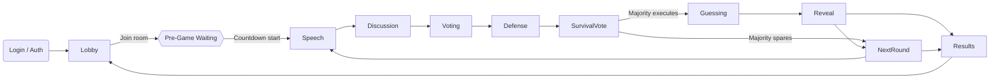
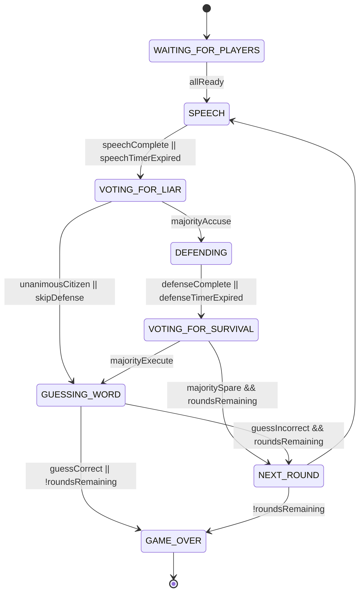

# Frontend Gameplay Step 1 – Requirement Alignment

## Deliverables Covered
- Screen flow derived from gameplay prompt with mapped routes and UI responsibilities.
- Shared DTO/event contract notes including schema versioning references for `game-flow/2024-09-18` and `game-realtime/2024-09-18`.
- State management approach combining React Query for server fetches, Zustand slices for gameplay state, and WebSocket action reducers.

## Screen Flow & Route Mapping
- **Login (`/login`)** → validates session and seeds auth store.
- **Lobby (`/lobby`)** → fetches room list, allows room creation/join, subscribes to lobby updates.
- **Game (`/game/:gameNumber`)** → renders multi-pane gameplay shell with subviews managed by current phase.
- **Results (`/results/:gameNumber`)** → shows final summary, scoreboards, rematch CTA.



### Phase Responsibilities within `/game/:gameNumber`
- **Pre-game waiting**: ready toggle, host controls, countdown overlay.
- **Speech**: ordered hint submission, live turn indicator, timer.
- **Discussion**: free chat, suspicion markers, timer.
- **Voting for liar**: ballot panel, majority tracker, disabled players.
- **Defense**: accused spotlight, defense input, skip control.
- **Voting for survival**: binary vote, results broadcast.
- **Guessing**: liar-only overlay, guess submission, citizens see suspense panel.
- **Reveal/Results interlude**: scoreboard update, animations, CTA for next round or final results.

## Round State Chart (authoritative phases)


### Entry/Exit Signals (sent over WebSocket)
- `GAME_STATE_UPDATE` always accompanies authoritative changes with `schemaVersion = game-flow/2024-09-18`.
- Phase swaps broadcast `PHASE_CHANGE`, timers use `COUNTDOWN_STARTED`/`TIMER_UPDATE` events tagged with `game-realtime/2024-09-18`.
- Voting uses `VOTING_PROGRESS`, `PLAYER_VOTED`, and terminal events `FINAL_VOTING_RESULT` or `GAME_END`.

## Shared DTO & Event Contract Notes
- Mirror Kotlin `GameStateResponse`, `VotingStatusResponse`, `DefenseSubmissionResponse`, `GameResultResponse`, `GameRecoveryResponse` with strict typing in `frontend/src/types/contracts/gameplay.ts`.
- Include discriminated union for realtime events keyed by `type` and schema version guards.
- Promote `GameContractVersions.GAME_FLOW` & `GameContractVersions.REALTIME_EVENTS` as constants exported from `frontend/src/types/contracts/versioning.ts`.
- Maintain mapping tables for `GamePhase`, `PlayerState`, `GameState`, and `ModeratorMessage.type` for UI copy.

## Client State Management Strategy
- **React Query**: lobby lists, historical data (chat history, past rounds), recover endpoints.
- **Zustand**: gameplay slice orchestrating WebSocket-driven state; separates `connection`, `participants`, `phase`, `timers`, `chat`, `ui` sub-slices.
- **Immer-powered reducers** within the store to apply contract payloads idempotently.
- **Event Bus**: small utility to register WebSocket handlers -> dispatch typed actions into the Zustand store.

```ts
// frontend/src/stores/gameplayStore.ts (sketch)
export interface GameplayState {
  meta: { gameNumber: number | null; schemaVersion: string | null }
  phase: { current: GamePhase; endsAt?: string; turnOrder: string[]; activePlayerId?: number }
  players: Record<number, PlayerSummary>
  chat: { messages: ChatMessage[]; unreadCount: number }
  voting: VotingSnapshot | null
  timers: Record<string, Countdown>
  actions: {
    hydrateFromSnapshot(snapshot: GameStateResponse): void
    applyEvent(event: GameRealtimeEvent): void
    reset(): void
  }
}
```

- **UI Store**: light-weight zustand slice tracking layout mode, modal visibility, toasts, aligned with gameplay store events.
- **React Query <-> Zustand bridge**: on successful mutations (e.g., cast vote) rely on WebSocket echoes; optimistic updates limited to local UI hints.

## Handoff Checklist for Step 2
- Contract definitions committed alongside generated TypeScript types.
- Skeleton `gameplayStore` ready for real handlers.
- Routing plan validated with design; next step focuses on WebSocket infrastructure and real-time synchronization.