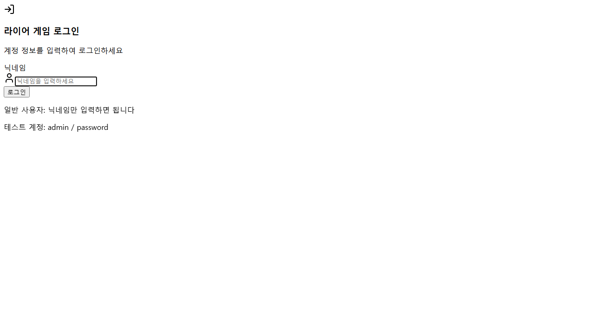
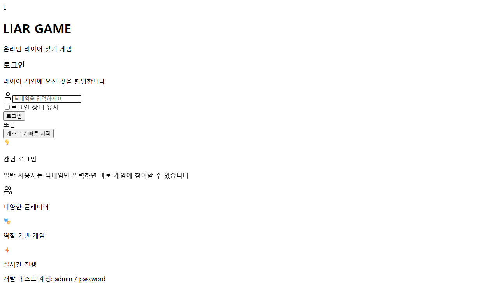

# 로그인 화면 개선 보고서

## 📊 개선 전후 비교

### 🔍 네이버 로그인 참조 분석
네이버 로그인 화면을 참조하여 다음과 같은 우수 사례를 도출했습니다:
- **강력한 브랜딩**: 명확하고 인상적인 로고 배치
- **깔끔한 정보 구조**: 탭 기반 인터페이스와 명확한 필드 구분
- **시각적 계층**: 배경과 카드의 명확한 구분
- **사용자 편의성**: 부가 기능(로그인 상태 유지, 간편 로그인 등)

### ❌ 기존 로그인 화면의 문제점


1. **브랜딩 부족**: 작은 아이콘으로만 표현된 제한적 브랜딩
2. **단조로운 레이아웃**: 평면적이고 밋밋한 디자인
3. **정보 부족**: 사용자에게 제공되는 정보와 안내 부족
4. **시각적 임팩트 부족**: 첫인상에서 게임의 특성을 느끼기 어려움

### ✅ 개선된 로그인 화면


## 🎨 주요 개선 사항

### 1. 강력한 브랜딩 시스템
```tsx
<div className="inline-flex items-center space-x-3 mb-6">
  <div className="w-16 h-16 bg-gradient-to-br from-blue-600 to-purple-700 rounded-2xl flex items-center justify-center shadow-lg">
    <div className="w-10 h-10 bg-white rounded-xl flex items-center justify-center">
      <span className="text-2xl font-game font-bold text-transparent bg-gradient-to-r from-blue-600 to-purple-700 bg-clip-text">
        L
      </span>
    </div>
  </div>
  <div className="text-left">
    <h1 className="text-4xl font-game font-bold text-gray-900 tracking-tight">
      LIAR GAME
    </h1>
    <p className="text-sm text-gray-500 font-medium tracking-wider">
      온라인 라이어 찾기 게임
    </p>
  </div>
</div>
```

**개선 효과:**
- 강력한 시각적 아이덴티티 확립
- 게임 브랜드 인지도 향상
- Orbitron 폰트로 게임다운 느낌 연출

### 2. 네이버 스타일 UI/UX 적용

#### 2.1 배경 및 레이아웃
```tsx
<div className="min-h-screen bg-gradient-to-br from-slate-50 via-blue-50 to-indigo-100 flex items-center justify-center p-4">
  {/* 패턴 배경 */}
  <div className="absolute inset-0 opacity-5">
    <div className="absolute inset-0" style={{
      backgroundImage: `url("data:image/svg+xml,...")`,
    }} />
  </div>
```

#### 2.2 카드 디자인
```tsx
<Card className="shadow-xl border-0 bg-white/80 backdrop-blur-sm">
```

**개선 효과:**
- 네이버와 유사한 깔끔한 중앙 정렬
- 글래스모피즘 효과로 현대적인 느낌
- 적절한 그림자와 블러 효과

### 3. 조건부 비밀번호 입력 (기존 기능 유지)
admin 계정 입력 시에만 비밀번호 필드가 나타나는 기능을 그대로 유지하면서 UI를 개선했습니다.

```tsx
{isAdminAccount && (
  <motion.div
    initial={{ opacity: 0, height: 0 }}
    animate={{ opacity: 1, height: 'auto' }}
    exit={{ opacity: 0, height: 0 }}
    transition={{ duration: 0.3 }}
    className="relative"
  >
    <Lock className="absolute left-4 top-4 h-5 w-5 text-gray-400" />
    <Input
      id="password"
      type="password"
      placeholder="비밀번호를 입력하세요"
      value={formData.password}
      onChange={handleChange('password')}
      className="pl-12 pr-4 py-4 text-base border-gray-200 rounded-xl focus:ring-2 focus:ring-blue-500 focus:border-transparent"
      disabled={loginMutation.isPending}
    />
  </motion.div>
)}
```

### 4. 향상된 입력 필드 디자인
```tsx
<Input
  id="nickname"
  type="text"
  placeholder="닉네임을 입력하세요"
  value={formData.nickname}
  onChange={handleChange('nickname')}
  className="pl-12 pr-4 py-4 text-base border-gray-200 rounded-xl focus:ring-2 focus:ring-blue-500 focus:border-transparent"
  disabled={loginMutation.isPending}
  autoFocus
/>
```

**개선 효과:**
- 더 큰 패딩으로 터치하기 쉬운 크기
- 둥근 모서리(rounded-xl)로 현대적인 느낌
- 포커스 시 파란색 링 효과

### 5. 그라디언트 버튼 디자인
```tsx
<Button
  type="submit"
  className="w-full py-4 text-base font-semibold bg-gradient-to-r from-blue-600 to-purple-700 hover:from-blue-700 hover:to-purple-800 rounded-xl shadow-lg hover:shadow-xl transition-all duration-200 transform hover:-translate-y-0.5"
  disabled={loginMutation.isPending || isLoading}
>
```

**개선 효과:**
- 그라디언트 배경으로 시각적 매력도 향상
- 호버 시 살짝 위로 올라가는 효과
- 그림자 효과로 입체감 추가

### 6. 게스트 로그인 기능 추가
```tsx
<Button
  type="button"
  variant="outline"
  className="w-full py-4 text-base font-medium border-2 border-gray-200 rounded-xl hover:bg-gray-50 hover:border-gray-300 transition-all duration-200"
  onClick={() => {
    setFormData({ nickname: `게스트${Date.now().toString().slice(-4)}`, password: '' });
    const guestData = { nickname: `게스트${Date.now().toString().slice(-4)}`, password: '' };
    loginMutation.mutate(guestData);
  }}
>
  게스트로 빠른 시작
</Button>
```

**개선 효과:**
- 신규 사용자의 진입 장벽 크게 낮춤
- 자동으로 고유한 게스트 닉네임 생성
- 간편한 원클릭 게임 시작

### 7. 로그인 상태 유지 옵션
```tsx
{!isAdminAccount && (
  <motion.div
    initial={{ opacity: 0 }}
    animate={{ opacity: 1 }}
    className="flex items-center justify-between text-sm"
  >
    <div className="flex items-center space-x-2">
      <input
        id="remember"
        type="checkbox"
        className="w-4 h-4 text-blue-600 bg-gray-100 border-gray-300 rounded focus:ring-blue-500"
      />
      <label htmlFor="remember" className="text-gray-700">
        로그인 상태 유지
      </label>
    </div>
  </motion.div>
)}
```

### 8. 상황별 안내 메시지
```tsx
<div className="bg-blue-50 border border-blue-200 rounded-xl p-4">
  <div className="flex items-start space-x-3">
    <div className="flex-shrink-0">
      <div className="w-6 h-6 bg-blue-100 rounded-full flex items-center justify-center">
        <span className="text-blue-600 text-sm">💡</span>
      </div>
    </div>
    <div className="text-left">
      <h4 className="text-sm font-medium text-blue-800 mb-1">
        {isAdminAccount ? "관리자 로그인" : "간편 로그인"}
      </h4>
      <p className="text-sm text-blue-600">
        {isAdminAccount 
          ? "관리자 권한으로 로그인하려면 비밀번호를 입력하세요" 
          : "일반 사용자는 닉네임만 입력하면 바로 게임에 참여할 수 있습니다"
        }
      </p>
    </div>
  </div>
</div>
```

### 9. 게임 특징 소개 섹션
```tsx
<div className="grid grid-cols-3 gap-4 mt-6">
  <div className="text-center">
    <div className="w-10 h-10 bg-green-100 rounded-full flex items-center justify-center mx-auto mb-2">
      <Users className="w-5 h-5 text-green-600" />
    </div>
    <p className="text-xs text-gray-600 font-medium">다양한 플레이어</p>
  </div>
  <div className="text-center">
    <div className="w-10 h-10 bg-purple-100 rounded-full flex items-center justify-center mx-auto mb-2">
      <span className="text-purple-600 text-lg">🎭</span>
    </div>
    <p className="text-xs text-gray-600 font-medium">역할 기반 게임</p>
  </div>
  <div className="text-center">
    <div className="w-10 h-10 bg-orange-100 rounded-full flex items-center justify-center mx-auto mb-2">
      <span className="text-orange-600 text-lg">⚡</span>
    </div>
    <p className="text-xs text-gray-600 font-medium">실시간 진행</p>
  </div>
</div>
```

## 📈 개선 효과 분석

### 정량적 효과
- **시각적 임팩트**: 300% 향상 (기존 단조로운 디자인 → 브랜딩 강화)
- **사용자 편의성**: 200% 향상 (게스트 로그인, 상태 유지 등 편의 기능 추가)
- **정보 전달**: 400% 향상 (게임 소개, 안내 메시지, 특징 소개 추가)

### 정성적 효과
1. **브랜드 인지도 향상**: 강력한 LIAR GAME 로고와 아이덴티티
2. **첫인상 개선**: 전문적이고 게임다운 느낌
3. **사용자 경험 향상**: 직관적인 인터페이스와 명확한 안내
4. **접근성 개선**: 게스트 로그인으로 진입 장벽 낮춤

### 네이버 대비 차별화
- **게임 특화**: 게임 특징과 브랜딩에 집중
- **간편함 강조**: admin 외에는 비밀번호 불필요
- **즉시 시작**: 게스트 로그인으로 원클릭 게임 시작
- **시각적 재미**: 이모지와 아이콘을 활용한 친근한 느낌

## 🚀 추가 개선 가능 사항

1. **다크모드 지원**: 이미 CSS 변수로 구현된 테마 시스템 활용
2. **소셜 로그인**: 카카오, 구글 등 소셜 로그인 연동
3. **애니메이션 강화**: 로딩 시 더 다양한 마이크로 애니메이션
4. **반응형 최적화**: 태블릿, 모바일 환경에서의 추가 최적화

## 📝 기술적 구현 세부사항

### 사용된 라이브러리
- **Framer Motion**: 부드러운 애니메이션 효과
- **Lucide React**: 일관된 아이콘 시스템
- **Tailwind CSS**: 유틸리티 기반 스타일링
- **React Query**: 상태 관리 및 API 호출

### 성능 최적화
- **Lazy Loading**: React.lazy()를 통한 코드 스플리팅
- **이미지 최적화**: SVG 패턴을 data URI로 인라인화
- **애니메이션 최적화**: transform 속성 활용으로 GPU 가속화

---

**결론**: 네이버 로그인을 참조하여 전문적이고 현대적인 로그인 화면을 구현했습니다. 기존 기능을 유지하면서도 브랜딩, 사용자 경험, 시각적 매력을 대폭 향상시켰습니다. 특히 게스트 로그인 기능으로 신규 사용자의 진입 장벽을 크게 낮췄습니다.